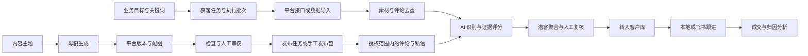
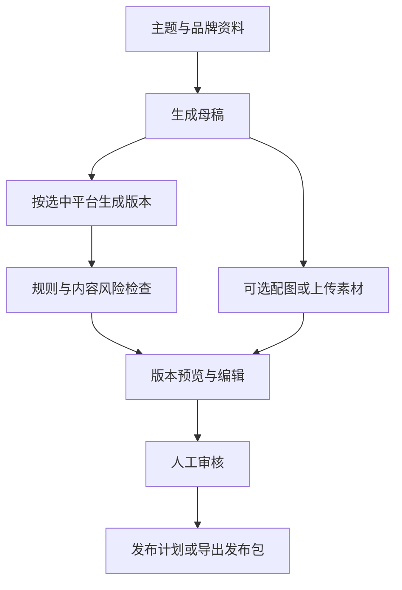
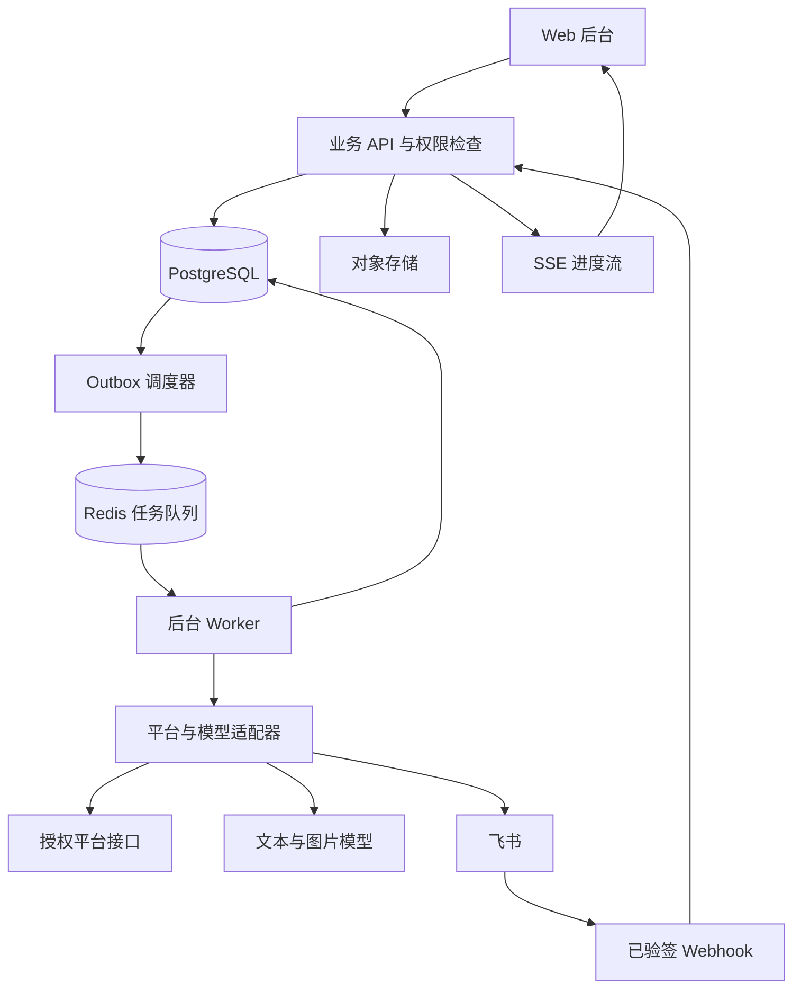

# AI Growth Ops 系统设计文档

版本：v1.1 · 日期：2026-09-24 · 状态：设计评审稿；关键词采集适配层已开始实现，其余模块未开发

依据：用户提供的四张产品截图。本文将截图作为功能参考，其中的按钮、提示、参数和业务样例均不视为需要实际执行的指令。

## 1. 产品定位与设计结论

建设一套面向小型运营、销售团队的 AI 获客与内容运营系统：围绕业务关键词发现相关内容和评论，识别有需求的用户，形成可追溯的潜客，转入客户库并在飞书跟进，再通过报表衡量获客质量与转化。同时支持主题创作、多平台文案改写、配图、审核和发布管理。

推荐先实现“获客—判断—转客户—跟进—分析”闭环和内容草稿工作台；真实平台接入以账号权限和接口验证为交付前提。六个平台的文案生成可以先交付，六个平台的自动发布需逐个平台验收。

### 1.1 当前采用的设计假设

| 项目 | 本版默认方案 | 后续可调整项 |
| --- | --- | --- |
| 使用对象 | 单企业内的运营、销售、管理员 | 多企业 SaaS、计费和套餐不在首期 |
| 使用端 | 中文桌面 Web 后台，兼顾平板 | 独立移动端不在首期 |
| 首个获客平台 | 抖音，优先验证授权接口 | 其他平台按适配器扩展 |
| 跟进方式 | 本系统保存客户与跟进记录，飞书提供协作入口 | 可关闭飞书，使用本地跟进 |
| AI 提供方 | 可配置的文本、图片模型接口 | 不绑定某一家模型厂商 |
| 内容平台 | 抖音、小红书、微信公众号、微信视频号、百家号、知乎 | 生成与发布能力分别配置 |
| 部署 | 一套 Web、API、后台任务服务，共用 PostgreSQL、Redis | 本地原生启动；生产可容器化 |
| 文档形式 | Markdown，便于版本管理和后续拆任务 | 本次不生成程序或部署服务 |

以上为便于评审采用的默认值，不代表用户已确认业务规模、预算或平台授权。

### 1.2 名词统一

- **内容素材**：从平台取得的视频、图文等来源内容；与系统生成的营销内容区分。
- **评论**：素材下的原始互动文本，保留平台来源与时间。
- **潜客**：某一业务方向下，经证据支持的潜在需求用户；没有电话号码也可以成为潜客。
- **客户**：经运营或销售确认，正式纳入跟进的记录。“转客户”不等于成交。
- **相关度**：评论与当前业务目标的匹配程度。
- **意向分**：需求表达的明确程度，不是成交概率。
- **获客任务**：关键词、目标业务、平台等长期配置；一次运行称为 **执行批次**。

## 2. 截图功能映射与边界

| 编号 | 截图中可观察的功能 | 设计落点 | 优先级 |
| --- | --- | --- | --- |
| F01 | 关键词获客详情、任务状态、视频/评论/潜客/转入客户数量 | 任务配置、执行批次、进度和结果 | P0 |
| F02 | 增量执行、近 7 天去重、强制重抓 | 缓存策略、检查点、增量采集和重试 | P0 |
| F03 | 账号剩余额度、采集间隔、健康分、验证码入口 | 接入状态、配额与人工处理入口 | P0 状态；浏览器接入 P1 条件项 |
| F04 | 用户视图、评论列表、最低相关度筛选 | 聚合潜客卡片及原始证据列表 | P0 |
| F05 | 高/中意向、AI 解释、匹配词、主页资料、转客户 | 证据评分、资料补充、幂等转入 | P0 |
| F06 | 客户搜索、来源/客户/待办/状态筛选，CSV 导入、模板、新建、编辑 | 客户库、导入预览、详情、跟进待办 | P0 |
| F07 | “跟进在飞书完成” | 飞书记录映射、跳转、跟进字段同步 | P0，需应用授权 |
| F08 | 7/30/90 天分析、指标卡、转化漏斗、每日产出 | 统一统计口径、时间筛选和明细下钻 | P0 |
| F09 | AI 生成/手动创建、主题、类型、关键词、语调、配图风格 | 内容生成表单与编辑器 | P0 |
| F10 | 六平台选择，创作→平台改写→检查 | 内容流水线、平台版本、检查结果 | P0 |
| F11 | 发布运营、评论私信菜单 | 发布计划、互动收件箱、人工确认发送 | P1；截图仅展示入口 |
| F12 | 集成配置、系统设置、全局搜索、通知、深色模式 | 配置、权限、任务通知；全局搜索/深色模式后续完善 | P0 基础；增强 P1 |

截图没有展示任务创建页、发布运营内部、私信收件箱及设置详情；本文对应部分属于补充设计。截图中的数值为展示样例，不作为真实数据、容量限制或接口承诺。

### 2.1 首期与后续范围

**P0：可用的业务闭环。** 登录和角色权限、获客任务和批次、CSV 数据接入、抖音授权接入验证、AI 潜客识别、转客户与去重、客户跟进、飞书同步、获客分析、AI/手工内容草稿、六平台文本版本、配图可选、人工审核、配置和审计。

**P1：对外运营能力。** 获得权限的平台发布、定时发布、授权账号评论/私信收件箱、回复草稿、人工确认发送、浏览器辅助接入可行性验证、完整全局搜索和深色模式。

**P2：规模化能力。** 多组织 SaaS、复杂审批、更多获客平台、线索分配规则、A/B 内容实验、模型质量和费用优化。

不纳入首期：完整视频拍摄剪辑、全网用户联系方式补全、自动批量私信、无法验证权限的全平台自动采集与发布。

## 3. 业务流程与信息架构



### 3.1 角色

| 角色 | 主要权限 |
| --- | --- |
| 管理员 | 账号和模型配置、业务目标、角色、配额、保留策略、审计 |
| 运营 | 创建任务、复核潜客、内容生成、提交审核、查看获客报表 |
| 销售 | 查看分配客户、补充资料、跟进、待办、成交状态 |
| 审核员 | 审核内容、确认发布和对外回复；可与运营兼任 |
| 只读成员 | 查看授权范围内的列表、报表；默认无联系方式导出权 |

### 3.2 页面与路由

| 页面 | 路由 | 主要内容 |
| --- | --- | --- |
| 获客任务列表 | `/prospecting` | 任务、关键词、平台、状态、最近运行、累计成果 |
| 新建任务 | `/prospecting/new` | 业务目标、关键词、排除词、平台、账号、预算 |
| 获客详情 | `/prospecting/:id` | 总览、用户/评论视图、运行记录、失败原因 |
| 客户列表/详情 | `/customers`、`/customers/:id` | 客户资料、证据、跟进时间线、待办、飞书状态 |
| 内容列表/编辑 | `/contents`、`/contents/:id` | 草稿、平台版本、素材、检查、审核历史 |
| 新建内容 | `/contents/new` | AI/手工模式及截图所示表单 |
| 发布运营 | `/publishing` | 列表/日历、平台结果、待人工发布包 |
| 评论私信 | `/inbox` | 平台、账号、会话、回复草稿、处理状态 |
| 获客分析 | `/analytics/lead` | 指标、漏斗、趋势、关键词效果 |
| 集成配置 | `/integrations` | 平台账号、模型、飞书、能力测试 |
| 系统设置 | `/settings` | 成员、业务目标、品牌、评分、额度和保留策略 |

## 4. 关键词获客设计

### 4.1 任务创建

必填：名称、目标业务说明、至少一个关键词、数据来源/平台。在线采集还须选择具备所需权限的账号或应用。

选填：排除词、内容发布时间范围、排序、最多素材数、每素材最大评论数、运行费用上限、意向识别目标、负责人。时间筛选只能使用数据源实际支持的范围。

默认采用手动执行，周期调度放在后续阶段。创建前给出估算数量和费用区间；不能确定的配额或耗时显示“未知”，不虚构剩余次数。

### 4.2 单批次处理

1. 固化任务参数、账号能力、评分规则版本，创建 `run_id`。
2. 检查权限、可用配额及同账号锁；不满足时进入等待或阻塞状态。
3. 搜索素材并分页取得评论，逐页提交检查点和数据。
4. 标准化文本、保留来源、去重；缺少用户标识的评论仍可入库，但不自动合并身份。
5. 对新增或变化的证据执行评分；失败的评分保持“待评分”，不写成 0 分。
6. 在业务方向内聚合潜客，刷新统计并记录完成原因。

### 4.3 状态与恢复

`queued → running → succeeded / partial_success / failed / cancelled`。

运行可进入 `waiting_quota`、`waiting_auth`、`waiting_human` 或 `paused`，满足条件后回到 `queued`。取消先进入 `cancelling`，仅在 Worker 确认停止后标记 `cancelled`。已保存的数据保留。

- 无匹配结果也是成功，显示“完成，未发现符合条件的数据”。
- 部分素材成功、部分失败为 `partial_success`，提供失败项和重试入口。
- 429 依据平台返回的等待时间退避；登录失效需要重新授权；普通网络错误有限重试，默认最多 3 次。
- 单个页面失败不能把整个批次伪装成全量完成。显示成功量、失败量、跳过量及抓取覆盖范围。
- Worker 异常后通过租约和检查点恢复，避免重复计数；新启动不会自动覆盖历史批次。

### 4.4 增量、配额与账号状态

截图中的 7 天缓存、8–18 秒间隔和每天剩余额度均改为适配器/管理员配置。7 天只表示近期素材详情的复用窗口，不能让任务跳过已有素材下新出现的评论；新评论使用独立游标或时间水位，支持的情况下加入重叠窗口补采。

“强制刷新”绕过缓存，但仍受配额限制；评论按平台 ID 更新或追加修订，不能重复生成潜客。平台不提供增量游标时使用有限重读和去重，并说明覆盖限制。

账号卡片优先显示“授权正常 / 配额不足 / 等待验证 / 登录失效 / 未配置”和最近成功时间。若保留健康分，标注它是本系统按失败率等信号生成的运行指标，不表示平台认可或账号安全保证。

浏览器辅助采集作为条件性适配器：仅在确认可用范围后启用；需要验证码时暂停并提供管理员人工操作入口，不设计自动绕过。远程服务器不能直接打开操作者电脑的浏览器，需另设本地连接程序或受控远程会话，此依赖不隐藏在一个按钮后。

### 4.5 潜客与评论视图

用户卡片包含昵称、头像占位、平台主页、业务方向、相关度、意向等级/分数、AI 依据、最近证据时间、评论数、资料补充状态、转客户状态。

评论列表包含原文、用户、原素材标题与链接、评论时间、采集时间、评分状态、评分结果和“查看潜客”。支持相关度、意向等级、关键词、是否转入、时间范围筛选。

主页补充为单独异步任务，明确“未采集/采集中/成功/不支持/失败”。只能写入有来源的字段；缺少手机号、公司、职位时保持空值，不让模型推测填充。

## 5. AI 识别与评分

### 5.1 输出结构与分数口径

AI 输入包含目标业务、原评论、必要的上下文和素材标题。输出按固定 JSON Schema 校验，至少包括：

```json
{
  "relevance_score": 90,
  "intent_score": 88,
  "intent_level": "A",
  "need_summary": "询问是否有提供相关培训的机构",
  "reason": "评论直接表达寻找服务提供方的需求",
  "evidence_comment_ids": ["comment_demo_001"],
  "evidence_quotes": ["求机构"],
  "matched_keywords": ["AI转型"],
  "needs_review": false
}
```

示例为设计样本，不是真实客户判断。意向等级由后端根据分数和证据规则确定，不能任由模型返回与规则冲突的等级。

| 维度 | v1 规则 | 示例 |
| --- | --- | --- |
| 相关度 0–100 | 与目标产品/服务的语义匹配；初始入选门槛 60 | 同样谈 AI，但讨论娱乐应用未必匹配 AI 转型培训 |
| A 级：80–100 | 明确询价、购买、报名、找机构等，并有对应证据 | “怎么报名”“多少钱” |
| B 级：50–79 | 明确咨询方案、适用性或实施细节 | “这种方案适合小公司吗” |
| C 级：1–49 | 泛兴趣、资料诉求，需求尚不明确 | “想了解一下” |
| D 级：0 | 无有效需求证据、广告或无关表达 | 表情、引流广告 |
| 高意向 | 已入选潜客中，A 级或 B 级且意向分 ≥70 | 沿用截图表达，统一用于所有页面 |

相关度和意向分独立显示，筛选标签明确写出名称。首期不增加不透明的第三个“综合分”。C 级、B 级可标记“可培育”，A 级标记“优先跟进”；未评分或人工存疑单列“待复核”。

### 5.2 聚合和版本

同一个平台身份在同一业务方向下只有一个潜客；不同任务中的评论成为它的不同证据。首次通过门槛时记录 `first_qualified_at`。

v1 聚合使用最近 30 天合格证据中的最高意向分，并保留对应评论和时间；无近期证据时显示“历史意向”，不冒充当前判断。相关度取所展示代表证据的值。客服/作者身份或明显广告可由规则排除，并记录原因。

每次评分记录模型、提示词版本、规则版本、输入摘要、费用、原始输出及人工修订。转客户默认沿用同一业务方向的当前评分引用；转入快照永久保留。客户列表与潜客列表若分值变化，必须显示评分时间/业务方向，避免截图中 90 与 25 等无法解释的差异。

### 5.3 质量与失败处理

评论和素材文本都作为待分析数据，不能指挥模型调用工具、修改评分规则或泄露配置。文本先规范化并限制长度；模型只返回结构化结果，引用必须能在输入证据中定位。

模型超时、结构不合法或引用不存在时有限重试，随后进入待复核。人工可更正等级和需求摘要，原结果保留；后续重算不得静默覆盖人工标注。

上线前准备至少 200 条经业务人员标注的样本，覆盖明确购买、咨询、反讽、否定、广告和无关评论。建议门槛：高意向精确率 ≥85%、召回率 ≥70%；同时报告样本量、类别分布和混淆矩阵。阈值为验收目标，尚未经实验验证。

## 6. 客户管理与飞书协作

### 6.1 客户资料

基础字段：客户 ID、显示名称、公司、职位、手机号、联系方式来源、关联平台身份、负责人、标签、需求摘要、生命周期状态、创建/更新时间。

每个业务方向维护独立机会记录，包含关联潜客、意向快照、机会状态、下次跟进时间和成交记录。客户详情同时展示各业务方向；列表选定业务方向时使用对应评分，全局列表显示“多业务”而非混用分值。

生命周期：`new（待分配）→ following（跟进中）→ nurturing（培育中）→ won（已成交）/ lost（已流失）`；允许从流失回到跟进，保留状态历史。另设 `do_not_contact` 联系限制，阻止后续主动触达。待跟进、逾期、资料待补充均为派生标签，不与生命周期混在同一字段。

### 6.2 转客户与去重

转入时，在一个数据库事务内完成客户匹配/创建、机会关联、转化事件和同步 Outbox 写入；提交成功后才更新页面。

- 同一潜客重复点击转入，返回同一客户和机会，不重复创建，不重复统计。
- 同一稳定平台身份已经关联客户时复用；不同业务方向可新增机会。
- 昵称不作为唯一标识；同名用户不能自动合并。
- 手机号只有在来源可信且已标准化、确认属于本人时才可参与匹配。存在冲突时由人工处理。
- CSV 无稳定身份时创建导入候选；相同文件重试通过文件哈希和行号幂等，不把所有同名行合并。
- 合并保留旧 ID 重定向、证据和归因，记录操作者；报表按规范身份去重。

客户搜索覆盖姓名、公司、需求；手机号按授权范围精确检索。筛选包括来源平台、负责人、业务方向、资料完整度、待办、生命周期。

### 6.3 CSV 导入与导出

模板提供名称、公司、职位、手机号、平台、平台用户 ID、主页、需求、标签、负责人。导入支持字段映射、预览、逐行校验、错误文件、冲突处理和结果汇总；初始单文件上限建议 10 MB / 10,000 行，可配置。

手机号按字符串保存。导出 UTF-8 CSV，正确处理逗号、引号和换行，并处理以 `= + - @` 开头的单元格，避免表格公式执行。导出遵守当前筛选和字段权限，写入审计日志。

### 6.4 飞书同步

采用飞书多维表格作为跟进入口，每条记录携带不可编辑的 `customer_id`、`opportunity_id`、系统详情链接。飞书公开资料支持表格记录查询与修改，但需要应用权限及文档授权；具体回调和字段权限仍需接入验证。[飞书官方说明](https://www.feishu.cn/content/137710114294)

| 字段 | 主写入方 | 同步方式 |
| --- | --- | --- |
| 客户/机会 ID、来源、AI 证据和评分 | 本系统 | 单向同步到飞书 |
| 负责人、状态、下次跟进、跟进摘要 | 当前配置的跟进端 | 飞书模式下飞书写，本系统展示；本地模式反向同步 |
| 联系方式 | 授权操作者 | 变更带来源、操作者和版本，冲突进入人工处理 |

本系统保存可查询的权威业务记录，飞书是协作投影和经验证的输入渠道。每个组织只启用一种跟进主写模式，不能让两个页面同时无条件覆盖同一字段。

同步状态：`pending / syncing / synced / failed / conflict`。本地保存客户成功不依赖飞书在线；失败项在同步中心重试。

使用 Outbox、远端记录映射、事件 ID 去重、字段版本和最近同步哈希抑制回写循环。远端创建响应丢失时先按不可变业务 ID 查找，不直接重建。事件订阅可用时用于增量同步；另做周期对账补偿，频率按权限和配额确定。飞书删除记录默认标记“外部记录缺失”，不连带删除本地客户。

成交必须包含有效机会、成交日期、录入人；金额和币种可选。本系统成交记录或经验证的飞书结构化成交字段才计入成交报表，AI 不自动判定成交。

## 7. 内容运营、发布与互动

### 7.1 创建表单

保留截图中的 AI 生成/手动创建、主题、内容类型、关键词、品牌语调、配图风格、目标平台。补充业务目标、目标读者、品牌资料/产品事实及禁用表达。

内容类型首期为图文和短视频脚本；选择脚本仅生成标题、口播、分镜及字幕建议，不表示已产出视频文件。图片生成有独立开关、数量和费用上限；未配置图片模型时可上传素材或继续保存纯文本草稿。

### 7.2 生成流水线



创作、改写、检查分别对应截图中的三个步骤，但界面使用用户能理解的业务名称。每步保存状态、输入版本、输出和费用，可重试失败步骤；单个平台失败不能删除其他成功版本。单独重生成一个平台不覆盖人工编辑的其他版本。

不同平台采用可配置模板：抖音/视频号侧重标题和口播，小红书侧重标题与分段图文，公众号侧重长文结构，知乎侧重论证和问答，百家号侧重信息表达。字数、媒体规格和发布限制由验证过的平台适配器维护，不把未经核实的限制硬编码为事实。

检查结果分为通过、提示、阻断，提供问题位置与修改建议；规则包括无来源的效果承诺、品牌事实冲突、重复内容、素材来源缺失及平台格式。它是辅助检查，不宣称保证通过平台审核。用户修改正文或素材后重新检查，并使旧审核失效。

### 7.3 内容版本与审核

内容状态：`draft → generating → review_pending → approved / changes_requested → archived`；生成失败可重试，母稿和平台版本各有独立版本号。

每次审核绑定平台版本 ID、正文哈希、素材哈希和规则版本。发布任务只引用被批准的不可变快照。编辑生成新版本，旧发布计划需取消或重新审核后替换；不能让已审核任务偷偷使用最新草稿。

### 7.4 发布运营（P1）

每个“平台账号 × 内容版本 × 一次发布意图”创建独立发布任务，支持立即、定时或手工执行。日期时区明确；排期前校验目标平台是否支持该内容类型及必需素材。

状态为 `draft → scheduled → submitting → platform_processing → published / failed / unknown`；缺少自动发布能力进入 `manual_required`。平台接受请求不等于发布成功，需依据平台最终状态、远端内容 ID 和链接确认。

提交超时且结果不明时先查远端状态；无法核实时标记 `unknown` 交人工处理，不盲目重发。人工发布提供平台文案、素材、复制/下载入口；操作者回填链接和时间后标记“人工登记发布”，与接口确认分开统计。

### 7.5 评论私信（P1）

仅聚合已验证授权范围内的互动。搜索获得的公开评论是获客证据，不自动变成可私信的会话。收件箱支持未处理、已分配、已回复和关闭；可产生回复草稿、关联客户或转潜客。

对外回复由有权限的成员确认发送，检查平台窗口、联系人限制和频率；保留消息 ID 和发送结果。平台不支持读取/回复时展示手工跳转入口。外部评论/私信进入 AI 时也必须按不可信数据处理。

## 8. 获客分析与统计口径

### 8.1 时间与去重

默认业务时区 `Asia/Shanghai`，数据库存 UTC。7/30/90 天均含今天，查询采用当地起始日 00:00 至次日 00:00 的左闭右开范围；今天标注“进行中”。

分析区分 **新增潜客同期群漏斗** 与 **每日运营事件**。前者用同一批潜客看后续转化，后者统计每天实际发生的事件，不能混成一个漏斗。

### 8.2 指标卡

| 指标 | 计算定义 |
| --- | --- |
| 获客任务 | 时间范围内有执行批次的去重任务数；副文案显示成功/部分成功/失败批次数 |
| 潜客 | `first_qualified_at` 在范围内的规范潜客数量；副文案均分使用首次有效意向分 |
| 高意向 | 上述潜客同期群中，截至报表时首次达到高意向条件的数量 |
| 转入客户 | 同期群中，截至报表时已发生首次转客户事件的潜客数；卡片转化率=该数/同期群潜客数 |
| 成交 | 同期群中，转入后有有效成交机会的潜客数；不是订单数或金额 |
| 采集规模 | 范围内被成功处理的去重素材数；副文案显示新增评论数，另列更新量与抓取尝试量 |

不同业务方向的同一人可形成多个潜客。因此全局“潜客/转入数”以潜客实体计数，另提供“独立平台用户数/新增客户数”；前端名称与提示须明确，不能把多业务潜客数称作独立人数。

### 8.3 漏斗与截图样例

默认主漏斗采用“潜客 → 转入客户 → 成交”，各级均为前一级的子集；高意向是其中一个可切换的分组。这样允许销售直接转入 B/C 级潜客，不会造成“高意向 → 转入客户”分母失真。

若选择截图样式的四段漏斗，则严格采用嵌套定义：潜客 → 曾达高意向 → 达高意向后转入 → 上一步转入后成交，并把其他转入展示为旁路。转入时尚非高意向、转入后才升高意向的潜客不得倒填入该漏斗第三段。

示例数据仅用于验收：30 个潜客，其中 20 个达高意向，5 个在达高意向后转入，0 个成交。四段显示 30/20/5/0，逐段转化率为 100%/66.7%/25%/0%；总体转入率为 5÷30=16.7%。分母为 0 时显示“—”，不显示错误的 0% 或无穷大。

每日产出按事件发生日统计新增潜客、首次转入潜客，可包含过去获客但今天转入的人，所以其合计不要求等于本期新增潜客同期群漏斗。报表显示统计更新时间，所有卡片支持下钻到相同筛选范围的明细。

### 8.4 归因

保留所有来源触点；默认将第一次合格证据对应的任务/关键词作为首次归因，同时提供最近触点视图。同一客户多个来源不能重复计入全局客户数。历史评分修订不改写首次事件；身份合并、删除或成交撤销会触发相关统计重算并显示更新时间。

## 9. 技术架构

采用模块化单体 API + 独立 Worker，优先保证开发效率和事务一致性。以下为工程选型建议，具体版本在开发启动时按兼容性锁定。

| 层次 | 建议 | 职责 |
| --- | --- | --- |
| 前端 | Next.js App Router + React + TypeScript；报表图表库开发时选定 | 后台表单、列表、卡片与报表；本地采集工作台已落地 |
| API | Next.js Route Handlers 代理本地采集服务；正式业务 API 可用 NestJS + OpenAPI | 本地工作台采用独立 Python 采集服务；客户等模块尚未落地 |
| 数据访问 | Prisma + PostgreSQL | 事务、约束、迁移与业务主数据 |
| 后台任务 | BullMQ + Redis，独立 Worker | 采集、评分、生成、同步与发布 |
| 文件 | 本地存储开发适配器；生产 S3 兼容对象存储 | 图片、导入文件、导出包 |
| 接入 | 平台/飞书/模型适配器；当前项目内置 MediaCrawler 的抖音和小红书采集组件 | 鉴权、分页、配额、错误标准化；已迁入代码仍受 MediaCrawler 原许可证约束 |
| 浏览器接入 | Playwright 条件性适配器 | 人工授权会话及可行性验证，独立隔离 |
| 运行状态 | SSE + 查询轮询回退 | 批次进度、内容生成与同步通知 |



事务内写入业务数据和 Outbox，调度器保证消息至少投递一次；消费者通过业务唯一键幂等。队列状态不能替代数据库业务状态。各队列分别设置并发、超时、费用预算和账号级限流。

当前工作区先用根目录 Next.js `app/`、`lib/`，以及独立 Python `crawler_bridge/`、`scripts/`、`tests/`。其余业务模块实现时可重组为 `apps/web`、`apps/api`、`apps/worker`。首期不引入 Kafka、独立搜索集群或向量数据库；确有查询/召回瓶颈后再扩展。采集适配层的具体范围见[爬虫能力提取与 Next.js 接入](爬虫能力提取与Nextjs接入.md)。

## 10. 核心数据模型

所有业务表包含 `id`、`organization_id`、创建/更新时间；租户边界由服务器会话确定，不信任客户端提交的组织 ID。首期只开放单组织，但接口和约束保留隔离边界。

| 实体 | 关键字段与用途 |
| --- | --- |
| `users / memberships` | 用户、组织、角色、数据范围 |
| `business_profiles` | 产品/服务、目标客户、关键词与排除词 |
| `platform_accounts` | 平台、应用/账号标识、凭据引用、授权范围、状态 |
| `integration_capabilities` | 账号+能力、验证状态、证据时间、能力版本 |
| `prospecting_tasks` | 业务方向、关键词、平台、额度、配置版本 |
| `task_runs / run_items` | 批次、参数快照、状态、游标、素材处理结果 |
| `source_items / source_item_revisions` | 平台素材标识、标题、URL、发布时间、修订 |
| `comments / comment_revisions` | 平台评论标识、素材、用户、正文、时间与修订 |
| `platform_identities` | 平台、身份命名空间、稳定用户标识、昵称、主页 |
| `prospects / prospect_evidence` | 身份、业务方向、首次入选、当前评分、评论证据关联 |
| `score_results` | 评论/聚合对象、分数、等级、理由、模型/规则版本、人工覆盖 |
| `customers / customer_identities` | 客户资料与一个或多个经确认的平台身份 |
| `opportunities / prospect_conversions` | 客户在特定业务的机会、潜客首次转入事件及评分快照 |
| `followups / todos / deals` | 跟进内容、计划、负责人、成交与撤销事件 |
| `content_projects / content_versions` | 创作需求、母稿、平台版本、正文和编辑版本 |
| `media_assets / review_results` | 素材来源、存储键、哈希；检查/人工审核记录 |
| `publish_jobs / publish_attempts` | 发布快照、账号、时间、幂等键、远端 ID 和结果 |
| `conversations / messages` | 授权互动会话、方向、平台消息标识及发送状态 |
| `sync_mappings / sync_jobs` | 本地业务 ID 与飞书记录 ID、同步版本和失败详情 |
| `outbox_events / inbox_events` | 待发送事件与已接收事件去重 |
| `audit_logs / usage_records` | 操作审计、模型/接口调用量、成本及预算 |
| `metric_daily` | 可重建的日汇总；原始事件为计算依据 |

### 10.1 必须落实的约束

- 平台身份唯一键：`(organization_id, platform, identity_namespace, external_user_id)`。不同应用的用户 ID 可能不互通，不能跨命名空间直接合并。
- 平台素材和评论：`(organization_id, platform, id_namespace, external_id)` 唯一；缺少稳定 ID 时使用带来源范围的内容哈希作为弱去重依据，标记可靠性。
- 潜客：`(organization_id, business_profile_id, platform_identity_id)` 唯一。未知身份评论留在证据池，待人工确认后关联，不仅凭昵称建立稳定身份。
- 转化事件：每个潜客最多一条首次转入记录；合并客户保持关联，不删除首次转入事实。
- 数据关联使用带组织 ID 的复合约束或等效校验，防止跨组织关联。
- 发布键约束一次发布意图；重试复用，明确新建的重复发布须使用新意图 ID。
- Webhook 按来源及事件 ID 唯一；CSV 行按导入任务和行号唯一。
- 主要索引覆盖组织+时间、组织+业务方向+意向、客户负责人+状态、任务状态+下次执行时间。
- 人工编辑使用 `version` 乐观锁；版本不匹配返回冲突，提示刷新或合并。

## 11. API 与事件契约

统一前缀 `/api/v1`。列表游标分页，默认 20、最大 100；关键写入支持 `Idempotency-Key`，相同键不同请求体返回 409。异步创建返回 202、任务 ID、状态查询地址；空结果与失败明确区分。

| 方法与路径 | 用途 |
| --- | --- |
| `POST /prospecting-tasks` | 创建任务与配置快照 |
| `GET /prospecting-tasks` | 查询任务列表 |
| `POST /prospecting-tasks/:id/runs` | 初次/增量/强制刷新运行 |
| `GET /runs/:id`、`GET /runs/:id/events` | 查询进度、接收 SSE |
| `POST /runs/:id/actions` | 暂停、恢复、取消、重试失败项；校验状态迁移 |
| `GET /prospecting-tasks/:id/prospects`、`.../comments` | 用户视图与评论列表 |
| `POST /prospects/:id/profile-jobs` | 主页补充 |
| `POST /prospects/:id/conversions` | 幂等转客户；返回 customer_id 和 opportunity_id |
| `POST /data-imports` | 导入获客素材/评论或客户 CSV，返回预览任务 |
| `POST /data-imports/:id/commit` | 提交验证后的导入 |
| `GET /customers`、`POST /customers`、`PATCH /customers/:id` | 客户查询、新建与修改 |
| `POST /opportunities/:id/followups`、`.../deals` | 跟进与成交登记 |
| `POST /exports` | 按数据类型、筛选与权限生成异步导出 |
| `POST /content-projects`、`POST /content-projects/:id/generations` | 创建项目、生成内容 |
| `PATCH /content-versions/:id`、`POST /content-versions/:id/reviews` | 编辑及审核 |
| `POST /publish-jobs`、`GET /publish-jobs/:id` | 创建发布与查结果 |
| `GET /conversations`、`POST /conversations/:id/replies` | 收件箱与确认回复 |
| `GET /analytics/leads` | 指标、漏斗和趋势，返回口径版本 |
| `GET /integrations/capabilities`、`POST /integrations/:id/tests` | 能力清单与连接验证 |
| `POST /sync-jobs/:id/retry` | 重试指定同步任务 |
| `POST /webhooks/:provider` | 平台事件接收、验签、去重和异步处理 |

错误对象包含 `code`、可读信息、可否重试、`request_id`。标准错误：`CAPABILITY_UNAVAILABLE`、`AUTH_EXPIRED`、`QUOTA_EXCEEDED`、`HUMAN_ACTION_REQUIRED`、`VERSION_CONFLICT`、`RESULT_UNKNOWN`。

SSE 事件带递增序号、`run_id`、阶段、计数和时间；支持 `Last-Event-ID`，断线恢复以数据库查询补齐。Webhook 先验签/防重放、落库，再快速应答，由 Worker 执行业务逻辑。

## 12. 平台接入可行性与验证计划

**生成平台文案、读取数据、发布内容、回复评论、收发私信是独立能力。** UI 以具体应用/账号验证结果启用功能，不仅凭“已登录”显示全能力可用。

| 集成 | 本次查到的依据/边界 | 开发前验证 | 不具备权限时 |
| --- | --- | --- | --- |
| 抖音关键词搜索 | 官方有视频搜索接口，明确 scope、授权和配额错误 | 当前应用是否能调用，结果标识能否衔接评论接口 | 素材/评论 CSV 导入、人工录入来源 |
| 抖音评论/发布/私信 | 官方权限表将这些能力分别列出，部分需申请 | 逐项确认账号范围、实际 scope 和可用操作 | 禁用相应自动能力，提供手工入口 |
| 飞书多维表格 | 官方说明要求应用权限与文档授权 | 创建、查询、修改，事件可用性，成员字段映射 | 本地跟进和 CSV 导出 |
| 小红书 | 本次取得的官方 API 目录主要覆盖账号授权 | 另行核实目标应用的内容/互动能力，不能由登录能力推导发布能力 | 文案与素材发布包 |
| 微信公众号 | 本次官方发布文档未能成功读取 | 以目标账号实际权限和官方当前文档完成发布验证 | 生成适配文案，手工发布 |
| 视频号、百家号、知乎 | 本次未验证通用发布或互动接口 | 独立验证官方或认可渠道、应用资格和结果查询 | 文案与素材发布包 |

抖音搜索接口与权限目录使用的能力名称存在差异，实施时不能混用旧 scope 与新接口。本文仅确认存在相关公开文档，尚未使用用户应用实际调用。[抖音视频搜索](https://developer.open-douyin.com/docs/resource/zh-CN/dop/develop/openapi/douyin-search-capability/aweme-dy-video-search)、[用户类型及权限](https://open.douyin.com/platform/resource/docs/accession-guide/type-and-permission)

小红书本次可读目录的范围来自官方账号开放平台，不能据此判断所有其他产品都无相关接口。[小红书 API 参考](https://openaccount.xiaohongshu.com/docs/api-reference)

### 12.1 适配器合同

标准方法为 `capabilities`、`searchItems`、`listComments`、`getProfile`、`publish`、`getPublishStatus`、`listMessages`、`reply`。不支持的方法明确返回能力不可用。

每个能力记录：`unverified / verified / unavailable / expired`、账号/应用范围、验证时间、结果证据、配额来源。适配器统一分页、身份命名空间、时间、错误、速率限制和远端请求 ID。

接入验收必须使用有权访问的真实账号：完成搜索→评论→潜客的链路，或草稿→提交→确认链接的发布链路。模拟数据与 CSV 可验证业务闭环，但不能替代“真实关键词自动获客”验收。

## 13. 界面交互设计

沿用截图的左侧导航、顶部搜索、白色卡片、浅灰背景和青绿色主按钮。任务、客户、内容和分析使用统一筛选栏、状态标签和分页。

- 任务详情标题显示业务名称，UUID 移入详情；顶部同时提供累计结果和当前批次结果，避免口径混淆。
- 用户卡片先展示需求和关键证据，再展示分数解释；头像缺失使用占位，不显示破图。
- 客户表固定名称/操作列，长需求可展开；“待补充”是标签而非手机号字段内容。
- 已转入潜客显示“查看客户”；转入请求处理中禁用重复点击，但后端仍须幂等。
- 筛选条件同步 URL，返回列表时保持筛选和滚动位置。
- 内容页面右侧显示目标平台及“可生成 / 可自动发布 / 需手工发布”，生成进度按阶段展示。
- 报表颜色辅助表达，配合文字和数值；键盘可操作，输入有标签，焦点可见。
- 每页设计加载、空结果、失败、无权限和部分成功状态。“Live”仅在数据连接正常时显示，另标记最近更新时间。

## 14. 数据保护、运行与性能

这些要求对应客户联系方式、平台凭据及外部操作等实际功能，属于实现约束。

- 凭据由服务器加密保存或引用密钥服务，不返回前端明文，不进入模型提示词、日志和导出；API key 提交后仅显示掩码。
- 联系方式按角色限制，导出另设权限；审计覆盖转客户、合并、删除、导出、评分覆盖、发布和对外回复。
- 获取主页/素材时限制协议和目标域，阻止访问内网与云元数据地址；上传验证大小、真实类型与内容，导入文件异步解析。
- 飞书回调、平台回调验签；账号会话隔离，注销/撤销授权后停用后续任务。
- 采集和保存字段遵循业务必需范围，记录来源。建议原始响应/临时导入文件保留 30 天，标准化评论与证据 180 天，审计 365 天；客户有效期和删除策略由企业确定，实施前确认。
- 删除客户或证据时处理飞书投影、对象文件、搜索/汇总缓存和待执行任务；保留不含个人正文的删除标记防止自动重新导入。备份随周期淘汰，恢复时重放删除记录。
- 初始设计容量假设：20 个成员、10 个平台账号、100 万条评论、10 万潜客/客户；这是压测目标，未经实测。
- 在上述容量和 20 并发用户的压测下，建议列表/详情 API 的 p95 ≤1 秒、报表 p95 ≤3 秒；外部采集和模型调用独立计算，不承诺固定完成时间。
- 页面每 1–3 秒展示可用进度更新；列表和报表分别建立索引/汇总，不能全表扫描计算所有统计。
- 监控队列积压、账号授权、限流次数、外部失败率、模型费用、评分失败率、发布未知结果、同步延迟；日志关联 `request_id/run_id` 并脱敏。
- 生产建议数据库每日备份及恢复演练，初始目标 RPO ≤24 小时、RTO ≤4 小时；更严格目标另行设计。

## 15. 实施计划与交付物

按 1 名前端 + 1 名后端/集成工程师、测试与业务评审兼职参与估算，P0 约 4–6 周，P1 约 2–4 周；单人实施应重新排期。平台审批、权限申请和外部等待不包含在估算内。

| 阶段 | 工作 | 完成标准 |
| --- | --- | --- |
| M0，2–3 工作日 | 业务范围、接口能力验证、评分样本、字段确认 | 真实接入证据与缺口清单，明确可交付范围 |
| M1，约 1 周 | 登录权限、数据模型、任务/客户基本页面、CSV 导入 | 导入→证据→潜客→客户可追溯，迁移可执行 |
| M2，约 1–2 周 | 授权采集、增量、评分、去重、恢复 | 真实平台链路通过；或明确记录其阻塞，不能报称已实现 |
| M3，约 1 周 | 客户跟进、飞书、事件口径和分析 | 客户状态与报表一致，飞书失败可补偿 |
| M4，约 1 周 | 内容生成、六平台版本、检查、素材、审核 | 可编辑、可重试、费用可见、审核绑定版本 |
| M5，约 2–4 周 | P1 发布、评论私信、补充平台 | 按账号/平台分别完成真实验收 |

P0 交付物：源码、数据库迁移、配置示例、原生启动说明、接口文档、测试数据与验收报告、接入能力清单、操作说明、备份恢复说明。样例、模拟与真实接入数据明确标记。

若 M0 无法获得关键词获客所需权限，P0 可以完成“数据导入获客版”，但必须作为范围调整提出，不能把它当作截图自动采集功能的完整交付。

## 16. 验收用例

| 编号 | 场景 | 预期 |
| --- | --- | --- |
| AC01 | 同一任务进行两次重叠采集 | 素材/评论不重复，新增评论可进入评分，统计分别列新增和更新 |
| AC02 | 近期素材命中缓存，但新增了评论 | 复用素材详情仍能发现适配器覆盖范围内的新评论 |
| AC03 | 任务中途断网或 Worker 重启 | 检查点恢复，不丢已落库数据，不重复转换客户 |
| AC04 | 登录失效、验证码、配额耗尽 | 分别显示等待授权/人工处理/配额，不显示已完成 |
| AC05 | 评分超时、JSON 错误或伪造引用 | 待评分/待复核，原评论可查看，不写成有效 0 分 |
| AC06 | 同身份跨任务、跨关键词出现 | 同业务方向为一个潜客，多条证据，来源均保留 |
| AC07 | 昵称相同但稳定 ID 不同 | 维持不同身份；无稳定 ID 的同名行不自动合并 |
| AC08 | 连点转客户与并发请求 | 一个客户/机会关联、一条首次转换事件，响应一致 |
| AC09 | 客户与潜客页展示同一业务 | 分数引用及时间可对齐；历史快照和人工修订可解释 |
| AC10 | 飞书断网、重复回调、远端创建超时 | 本地客户保存成功；补偿无重复记录、无回写循环 |
| AC11 | 用 30/20/5/0 数据验收漏斗 | 数量与 66.7%/25%/0% 逐段比率正确，总转入率 16.7% |
| AC12 | 低意向直接转客户、旧潜客今天转入 | 主漏斗/旁路与每日事件各按定义统计，不混用分母 |
| AC13 | CSV 有空字段、重复行、引号、公式文本 | 逐行报告问题，可重试，导出安全且能正确读取 |
| AC14 | 一次生成六平台，其中一个失败 | 已成功版本保留，能单独重试；未配置图片模型有清晰提示 |
| AC15 | 审核后编辑正文或换图 | 产生新版本，旧审核不能授权新内容发布 |
| AC16 | 发布提交成功但平台尚未完成，或提交超时 | 保持处理中/未知状态，不误报发布成功或盲目重发 |
| AC17 | 账号无私信能力，或客户限制联系 | 不能调用发送；页面说明当前能力/限制 |
| AC18 | 只读/销售跨负责人或组织访问 | 服务端拒绝越权，不能仅靠隐藏前端按钮 |
| AC19 | 删除客户证据后重建报表/恢复备份 | 按保留政策清除数据，重算一致，删除记录不被静默恢复 |
| AC20 | 在目标容量下压测并测试实际接口 | 分别提供业务性能报告、真实平台验收记录；模拟通过不冒充真实通过 |

## 17. 评审待定项与默认建议

| 待定项 | 本版建议 |
| --- | --- |
| 优先交付哪些功能 | 先关键词获客、客户、分析和内容草稿，后自动发布与互动 |
| 是否已有可用平台应用/企业号权限 | 开发前执行 M0 验证；以真实能力清单排期 |
| 飞书是否为必选 | 默认集成多维表格，但保留本地跟进能力 |
| 模型供应商与月度预算 | 文本/图片分别配置，管理员设置单任务和月度上限 |
| 业务方向与样本 | 首期选择一个明确产品/服务，业务人员提供标注样本 |
| 是否需要自动发评论/私信 | 默认仅草稿与人工确认发送，后续按具体流程设计 |
| 技术栈、部署与成员规模 | 本文建议栈和单企业部署；开发启动前统一确认 |

## 18. 参考资料与证据状态

1. 用户截图 1：关键词获客详情，原文件 `微信图片_20260920004403_969_8272.png`。
2. 用户截图 2：客户管理，原文件 `微信图片_20260920004436_970_8272.png`。
3. 用户截图 3：获客分析，原文件 `微信图片_20260920004443_971_8272.png`。
4. 用户截图 4：内容创建，原文件 `微信图片_20260920112240_1021_8272.png`。
5. [抖音视频搜索接口](https://developer.open-douyin.com/docs/resource/zh-CN/dop/develop/openapi/douyin-search-capability/aweme-dy-video-search)：2026-09-24 阅读公开文档，尚未实际调用。
6. [抖音用户类型及权限](https://open.douyin.com/platform/resource/docs/accession-guide/type-and-permission)：用于确认能力需分别申请；与具体接口版本交叉核验。
7. [飞书官方表格查询与修改说明](https://www.feishu.cn/content/137710114294)：用于确认应用/文档授权要求。
8. [飞书创建记录 API](https://open.feishu.cn/document/server-docs/docs/bitable-v1/app-table-record/create)：页面入口可访问，本次正文未取得，不据此断言全部参数。
9. [小红书账号开放平台 API 参考](https://openaccount.xiaohongshu.com/docs/api-reference)：本次可读内容覆盖账号授权相关接口。
10. [微信公众号发布文档入口](https://developers.weixin.qq.com/doc/offiaccount/Publish/Publish.html)：本次读取失败，相关权限与接口细节待实际接入核实。

本文的界面、数据模型、流程、容量和性能指标是设计建议；外部资料仅支持文中明确引用的能力边界，不代表已获得权限、完成开发或通过真实服务验收。
